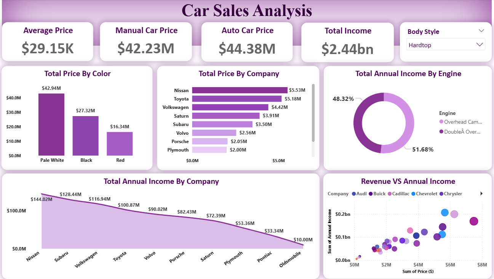
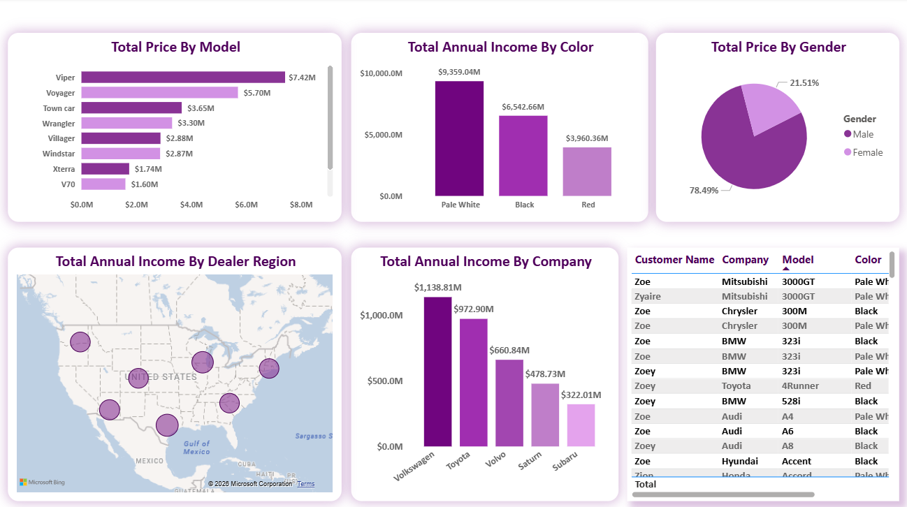

# 🚗 Car Sales Analysis – Power BI

---

## 📌 Overview
This project presents a **Car Sales Analysis Dashboard** built using **Power BI** to analyze sales performance, income distribution, customer purchasing behavior, and pricing trends.

The dashboard provides insights into company performance, regional sales distribution, engine type analysis, and customer demographics to support better business decision-making.

The dataset was cleaned and transformed using **Power Query** and analyzed using **DAX measures** to generate meaningful KPI metrics and business insights.

---

## 📊 Key Metrics & KPIs

- Manual Car Price: $42.23M  
- Automatic Car Price: $44.38M  
- Total Income: $2.44bn  
- Average Price: $29.15K  

---

## 📈 Dashboard Visualizations

### Car Sales Overview Dashboard

### Customer & Regional Analysis

---

## 📈 Dashboard Insights

### Total Price by Color
- Pale White generates the highest sales revenue
- Black and Red follow as the next top-performing colors

### Total Price by Company
Top-performing companies include:
- Nissan
- Toyota
- Volkswagen
- Saturn
- Subaru

### Total Annual Income by Company
- Volkswagen contributes the highest annual income
- Toyota and Volvo also show strong revenue performance

### Engine Type Analysis
- Double Overhead Cam and Overhead Cam engines contribute nearly equal revenue shares

### Gender Distribution
- Male customers contribute the majority of total sales revenue
- Female customer contribution remains comparatively lower

### Regional Analysis
- Revenue distribution analyzed across dealer regions using map visualization

---

## 🛠️ Data Preparation

### Power Query (ETL Process)
- Removed null values and duplicate records
- Corrected incorrect data types
- Split and transformed columns
- Standardized income and pricing formats
- Built a clean analytical dataset

### DAX (Data Analysis Expressions)
Created calculated measures for:
- Auto vs Manual Car Price
- Total Income
- Average Price
- Gender Distribution
- Company-wise Revenue Analysis

---

## 📊 Dashboard Features

- KPI Cards
- Interactive Filters & Slicers
- Bar Charts
- Donut Charts
- Scatter Plot Analysis
- Regional Map Visualization
- Company & Model Performance Analysis

---

## 🎯 Conclusion

This dashboard provides a comprehensive understanding of car sales performance by analyzing revenue patterns, customer preferences, company performance, and regional trends.

It supports data-driven decision-making and helps identify key business opportunities for improving sales strategy and operational performance.
